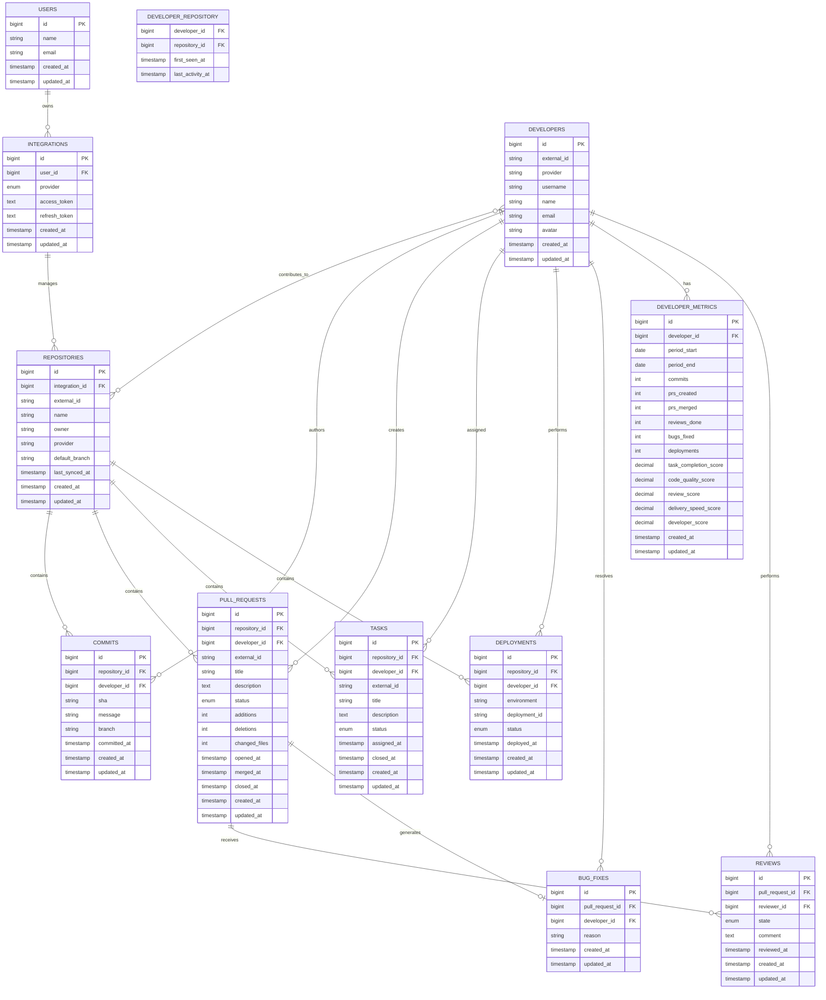

```mermaid
erDiagram
    USERS ||--o{ INTEGRATIONS : owns

    INTEGRATIONS ||--o{ REPOSITORIES : manages

    DEVELOPERS }o--o{ REPOSITORIES : contributes_to

    REPOSITORIES ||--o{ COMMITS : contains
    REPOSITORIES ||--o{ PULL_REQUESTS : contains
    REPOSITORIES ||--o{ TASKS : contains
    REPOSITORIES ||--o{ DEPLOYMENTS : contains

    DEVELOPERS ||--o{ COMMITS : authors
    DEVELOPERS ||--o{ PULL_REQUESTS : creates
    DEVELOPERS ||--o{ TASKS : assigned
    DEVELOPERS ||--o{ DEPLOYMENTS : performs
    DEVELOPERS ||--o{ BUG_FIXES : resolves
    DEVELOPERS ||--o{ DEVELOPER_METRICS : has

    PULL_REQUESTS ||--o{ REVIEWS : receives
    DEVELOPERS ||--o{ REVIEWS : performs

    PULL_REQUESTS ||--o| BUG_FIXES : generates

    USERS {
        bigint id PK
        string name
        string email
        timestamp created_at
        timestamp updated_at
    }

    INTEGRATIONS {
        bigint id PK
        bigint user_id FK
        enum provider
        text access_token
        text refresh_token
        timestamp created_at
        timestamp updated_at
    }

    REPOSITORIES {
        bigint id PK
        bigint integration_id FK
        string external_id
        string name
        string owner
        string provider
        string default_branch
        timestamp last_synced_at
        timestamp created_at
        timestamp updated_at
    }

    DEVELOPERS {
        bigint id PK
        string external_id
        string provider
        string username
        string name
        string email
        string avatar
        timestamp created_at
        timestamp updated_at
    }

    DEVELOPER_REPOSITORY {
        bigint developer_id FK
        bigint repository_id FK
        timestamp first_seen_at
        timestamp last_activity_at
    }

    COMMITS {
        bigint id PK
        bigint repository_id FK
        bigint developer_id FK
        string sha
        string message
        string branch
        timestamp committed_at
        timestamp created_at
        timestamp updated_at
    }

    PULL_REQUESTS {
        bigint id PK
        bigint repository_id FK
        bigint developer_id FK
        string external_id
        string title
        text description
        enum status
        int additions
        int deletions
        int changed_files
        timestamp opened_at
        timestamp merged_at
        timestamp closed_at
        timestamp created_at
        timestamp updated_at
    }

    REVIEWS {
        bigint id PK
        bigint pull_request_id FK
        bigint reviewer_id FK
        enum state
        text comment
        timestamp reviewed_at
        timestamp created_at
        timestamp updated_at
    }

    TASKS {
        bigint id PK
        bigint repository_id FK
        bigint developer_id FK
        string external_id
        string title
        text description
        enum status
        timestamp assigned_at
        timestamp closed_at
        timestamp created_at
        timestamp updated_at
    }

    DEPLOYMENTS {
        bigint id PK
        bigint repository_id FK
        bigint developer_id FK
        string environment
        string deployment_id
        enum status
        timestamp deployed_at
        timestamp created_at
        timestamp updated_at
    }

    BUG_FIXES {
        bigint id PK
        bigint pull_request_id FK
        bigint developer_id FK
        string reason
        timestamp created_at
        timestamp updated_at
    }

    DEVELOPER_METRICS {
        bigint id PK
        bigint developer_id FK

        date period_start
        date period_end

        int commits
        int prs_created
        int prs_merged
        int reviews_done
        int bugs_fixed
        int deployments

        decimal task_completion_score
        decimal code_quality_score
        decimal review_score
        decimal delivery_speed_score

        decimal developer_score

        timestamp created_at
        timestamp updated_at
    }

```